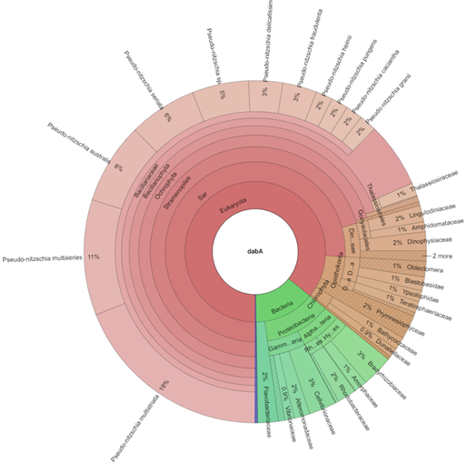

An interactive tool for in-silico assessment of inclusivity of a primer-probe set. 
================

##### Ahmed I. Alrefaey (02/08/22)

### Introduction

Nucleic acid-amplified detection is becoming one of the most prominent methods for genetic analysis. The amplification specificity of molecular assays is currently validated by traditional post-confirmation techniques including electrophoresis, melting analysis, and sequencing of amplified products. Amplicons’ noises remain a difficult issue that possibly originated from environmental samples and highly variable targets at the intra-species level. The proposed model-based algorithm in this study could be applied to various assay designs to simulate the real-world conditions of molecular analytics. The inclusivity of primers and probe set was evaluated in-silico across a wide taxonomic coverage in the marine environment using the bioinformatic tool ecoPCR (Ficetola et al., 2010). Sequences from multiple datasets served as a reference genome for the ecoPCR program to test amplification inclusivity against target species and non-target species. The relative abundance of the amplified species was demonstrated using Krona interactive chart (Ondov et al., 2011).

### Setup the pipeline 

#### 1. Creating working directory under the home directory.

To build the reference database from NCBI nr database ((https://www.ncbi.nlm.nih.gov/), (MMETSP) database (https://www.imicrobe.us/), and the EMBL-European Nucleotide Archive (https://www.ebi.ac.uk/ena/browser/home).

``` bash
$ mkdir interactive_chart
```

#### 2. Activating the virtual environment:

``` bash
$ conda create -n interactive_chart python=2.7.14
$ conda activate interactive_chart
```


#### 3. Installing obiTools within Python environment:

A package designed for metabarcoding pipelines. It requires Python 2.7. (https://pythonhosted.org/OBITools/welcome.html)

``` bash
$ conda install -c bioconda obitools
```


#### 4. Import the sequencing data from embl database.

``` bash
$ wget ftp://ftp.ebi.ac.uk/pub/databases/ena/sequence/con-std_latest/std/STD*.fasta.gz

$ gunzip *.gz
```
#### 4. Import the sequencing data from ncbi database.

``` bash
$ wget ftp://ftp.ncbi.nih.gov/genbank/.seq.gz

$ gunzip *.gz
```

#### 5. Clone MMETSP repository into working directory

``` bash
git clone https://de.cyverse.org/data/ds/iplant/home/shared/imicrobe/projects/ interactive_chart
```

#### 6. Organise headers of .fasta files
``` bash
sed '/^>/{ s/[^ ]* />/; s/ DNA.*//; s/ gene.*//; s/ genes.*//; }' STD_PRO_1.fasta
```

#### 7. Download the NCBI taxonomy


``` bash
$ mkdir taxo
$ cd taxo
$ wget 'ftp://ftp.ncbi.nih.gov/pub/taxonomy/taxdump.tar.gz'
$ tar -zxvf taxdump.tar.gz
```
#### 8. Format the taxonomy for OBITools package.
obitaxonomy will convert all the files in our directory TAXO into the taxonomy database.
``` bash
$ obitaxonomy -t taxo -d taxo
```
#### 9. Create the ecoPCR database.
ecoPCR in silico PCR preserves the taxonomic information of the selected sequences, and allows various specified conditions for the in silico amplification. 

``` bash
$ mkdir ecoPCR
```
#### 10. Attribute the taxonomic IDs to the sequences.

``` bash
$ obiaddtaxids -d ./taxo  ./db/*.fasta > ./db/.taxid.fasta
```
#### 11. Convert taxid files into ecoPCR format.

``` bash
$ obiconvert -d ./taxo --fasta --ecopcrdb-output=./ecoPCR/ecoPCR--skip-on-error ./db/*.taxid.fasta
```
#### 12. Use ecoPCR to simulate amplification.

``` bash
ecoPCR -d ./ecoPCR -e 9 -l 80 -L 200 TCAACTCGGTCTTCATTCTCATGGA GGATGAAATTCTCGAATCGGCCTC AAGTGCCAAACGTTCTTCTTCG > ncbi2_ref_t.ecopcr
```
We used a relaxed amplification conditions whilst maximum mismatch is 9
and amplicon length = from 80 -200 bp.


#### 13. Filtration and Clean the data resulting from ecoPCR.
First, convert ecoPCR output into fasta file.

``` bash
$ obiconvert --ecopcr db_ref1.ecopcr --skip-on-error --fasta-output > db_ref1.fasta
```
Second, filter sequences so that they have a good taxonomic description at the species, genus, and family levels.

``` bash
$ obigrep -d ecopcr --require-rank=species \ --require-rank=genus --require-rank=family db_ref1.fasta > db_ref2.fasta
```
Third, remove redundant sequences

``` bash
$ obiuniq ‐d ecopcr *ref2.fasta > ref2*.uniq.fasta
```
Forth, ensure that the dereplicated sequences have a taxid at the family level

``` bash
obigrep ‐d pln_r143 ‐‐require‐rank=family ref2*.uniq.fasta > ref2*.taxid.fasta
```

Fifth, addition of record annotations to reads.

``` bash
$ obiannotate --with-taxon-at-rank=phylum --with-taxon-at-rank=class --with-taxon-at-rank=subclass --with-taxon-at-rank=order --with-taxon-at-rank=family --with-taxon-at-rank=genus --with-taxon-at-rank=species ref2*.fasta > ref2*.hightax.fasta
```
#### 14. Visualization with amplicons of the ecoPCR test.
Finally, we can visualize the results of the ecoPCR analysis with Krona, which displays hierarchical data (like taxonomic assignation) in multi-layerd pie charts. For krona tool installation and usage instructions please refer to: https://github.com/marbl/Krona/wiki/KronaTools

``` bash
$ ktImportTaxonomy -t 2 -s 3 -d 100 -n dabA ref2*.hightax.fasta -o ecoPCR_dabA.html
```




The interactive krona chart is self-contained and can be viewed with any modern web browser.
